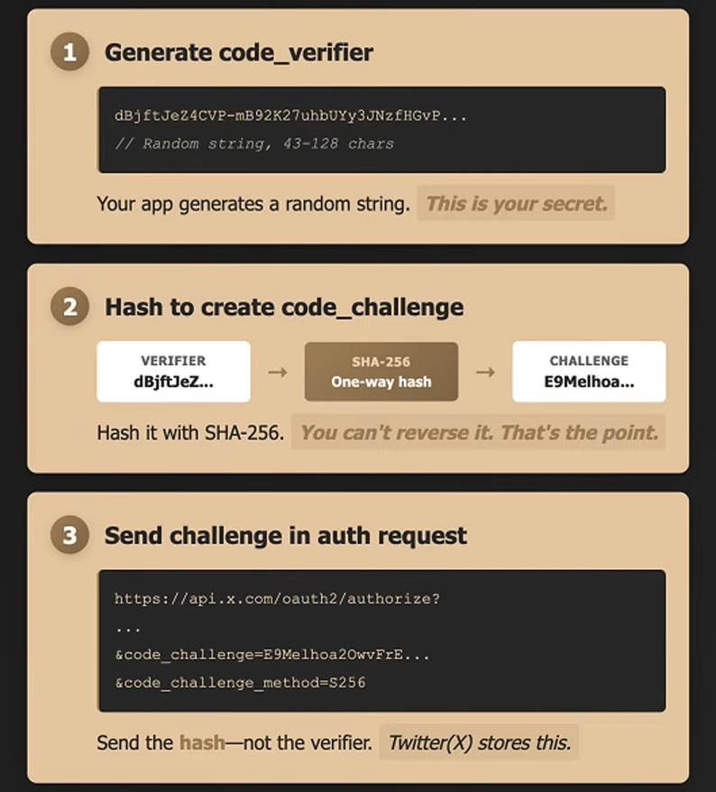
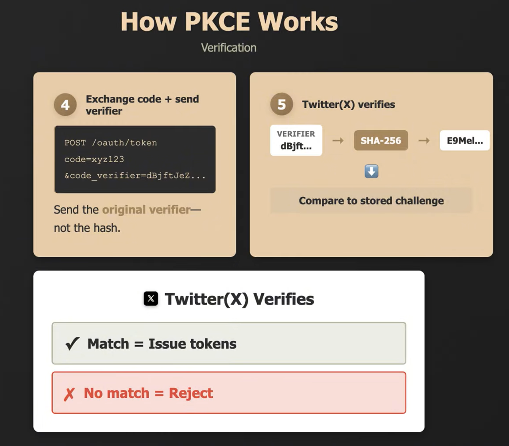
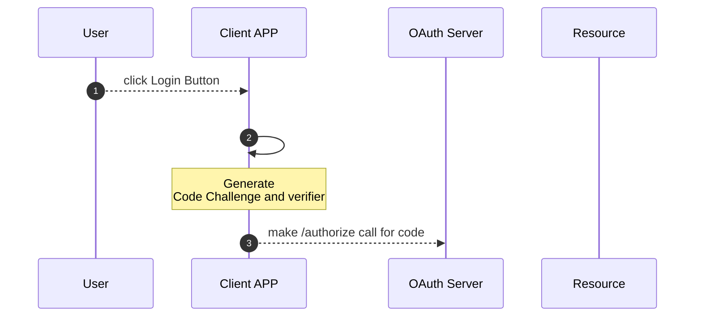

# OAuth 2.0

Authorization Server
Resource Server

Access Token / Refresh Token

OAuth Flows

* **Authorization Code Flow** - Code is the key to generate access token to access resource.

* **Client Credentials Flow** - Application authenticate with client id and client secret then generate access token to
  access
  resource.
* **Resource Owner Password Flow** - Directly user enter username and password after successfully authentication access
  token
  will generate.

# PKCE - Proof Key for Code Exchange

PKCE generate's two information

* **_Code Verifier_** - App generate Random string called `Code Verifier`.

* **_Code Challenge_** - Hashing `Code Verifier` with `SHA-256` called `Code Challenge`.
> **Code Challenge** is `base64url(sha256(code_verifier))`

## How PKCE Works ?

# Resource

https://youtu.be/DdhJvxztALI?si=R7G7nHmXolLsNSTT

## Authorization Code Flow + PKCE

