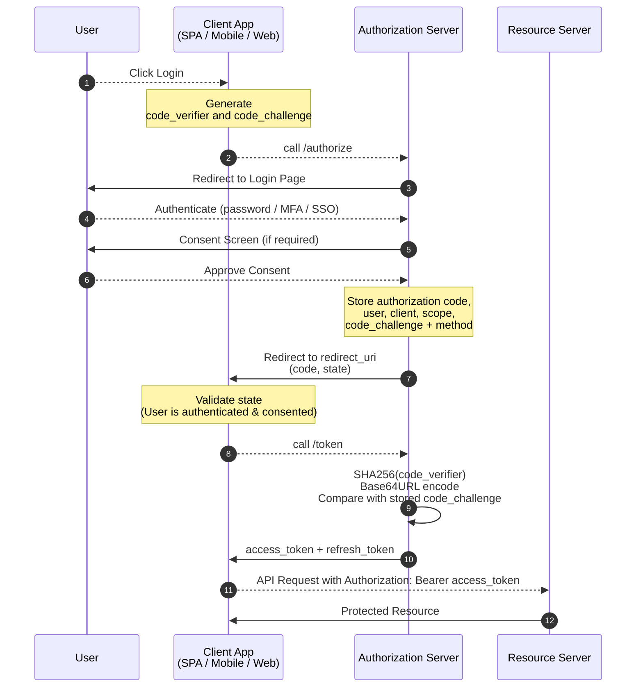

# OAuth 2.0

## OAuth Flows

* **Authorization Code Flow** - Code is the key to generate access token to access resource.

* **Client Credentials Flow** - Application authenticate with client id and client secret then generate access token to
  access
  resource.
* **Resource Owner Password Flow** - Directly user enter username and password after successfully authentication access
  token
  will generate.

## Grant Types

In OAuth 2.0, the term **'grant type'** refers to the way an application gets an access token.

* Authorization Code
* PKCE
* Client Credentials
* Device Token
* Refresh Token

### Authorization Code

The Authorization Code grant type is used by confidential and **public clients to exchange an authorization code** for
an
access token.

## What is PKCE - Proof Key for Code Exchange

PKCE generate's two information

- `code_verifier` → High-entropy random string (43–128 characters)
- `code_challenge` → `bas64url(sha256(code_verifier))`

## Authorization Code Flow + PKCE (HLD)



## 🔐 How PKCE is working? (LLD)

### 1️⃣ Login (Client Side)

When the user clicks **Login**, the client application generates a **PKCE pair** and stores the `code_verifier`
securely (memory / session / secure storage) for later use.

- `code_verifier` → High-entropy random string (43–128 characters)
- `code_challenge` → `bas64url(sha256(code_verifier))`

### 2️⃣ Invoke `/authorize` Endpoint

The client prepares an **authorization request** and redirects the user’s browser to the Authorization Server.

```url
https://auth-server.com/authorize
  ?response_type=code
  &client_id=h9wqrtqkmq7631p15v-siAwa
  &redirect_uri=https://www.oauth.com/playground/authorization-code-with-pkce.html
  &scope=photo+offline_access
  &state=B3X7B85DxEamQV_L
  &code_challenge=aRTFQY9QWPm-8q7VLThoyAoDItONVXXI22SAiPOcQbQ
  &code_challenge_method=S256
```

> `state` is a random string used for **CSRF protection** and request correlation.

### 3️⃣ User Authentication & Consent

The Authorization Server:

1. Authenticates the user (login, MFA, SSO, etc.)
2. Displays a consent screen (if required)
3. Validates the authorization request parameters

The server stores the following temporarily, bound to the authorization code:

* `client_id`,`redirect_uri`,`scope`,`code_challenge`,`code_challenge_method`,`authenticated user`

### 4️⃣ Redirect Back to Client

Now the user was redirected back to the client with a few additional query parameters in the URL:

```url
https://client-app.com/callback
  ?code=RiIKa-WTQYKgya_esmeuKvUxHbv830Ktdjkoa4e754gHNIl2
  &state=B3X7B85DxEamQV_L 
```

At this point:

* ✅ User is authenticated
* ✅ Consent is granted
* ❌ No access token exists yet

The client must validate the returned state value to **prevent CSRF attacks**.

### 5️⃣ Exchange Authorization Code for Tokens

The client now exchanges the authorization code for tokens by calling the token endpoint.
> The previously stored `code_verifier` must be sent in this request.

```url
POST https://authorization-server.com/token
  ?grant_type=authorization_code
  &client_id=h9wqrtqkmq7631p15v-siAwa
  &client_secret=bafPE8aCuZsXjw1ZZngwJl9C-uDS93lwVIoyBT4nlh5QP3Gl
  &redirect_uri=https://www.oauth.com/playground/authorization-code-with-pkce.html
  &code=RiIKa-WTQYKgya_esmeuKvUxHbv830Ktdjkoa4e754gHNIl2
  &code_verifier=2hevbzj0-ErqW45HhecGzMbQ5RCPyw7xv2h04txtmsFMTBGD
```

> 🔐 Public clients (SPA / Mobile) must not use client_secret<br>
> 🔐 Confidential clients authenticate using client_secret or mTLS

### 6️⃣ PKCE Verification

The Authorization Server verifies PKCE by computing:

> base64url(sha256(code_verifier))

The result must match the previously stored `code_challenge`.

* ✅ Match → Tokens are issued
* ❌ Mismatch → Request is rejected

This step prevents **authorization code interception attacks**.

### 7️⃣ Token Endpoint Response

If verification succeeds, the Authorization Server responds with tokens:
Here's the response from the token endpoint! The response includes the access token and refresh token.

```json
{
  "token_type": "Bearer",
  "expires_in": 86400,
  "access_token": "mHAhfrWiJzo5KQ90l1ODvLiTgcpK4XPCTYHBtp5TGlq1efS3wRdNN6EOOByPL_TLobNZkO27",
  "scope": "photo offline_access",
  "refresh_token": "-kGqhwMRBrcaoGrBGCOCY2MI"
}
```

The client can now call protected APIs on behalf of the user.

## Resource

https://youtu.be/DdhJvxztALI?si=R7G7nHmXolLsNSTT
