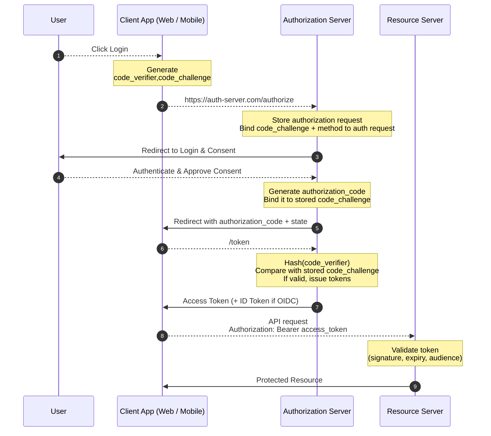

# OAuth 2.0

## OAuth Flows

* **Authorization Code Flow** - Code is the key to generate access token to access resource.

* **Client Credentials Flow** - Application authenticate with client id and client secret then generate access token to
  access
  resource.
* **Resource Owner Password Flow** - Directly user enter username and password after successfully authentication access
  token
  will generate.

## Grant Types

In OAuth 2.0, the term **'grant type'** refers to the way an application gets an access token.

* Authorization Code
* PKCE
* Client Credentials
* Device Token
* Refresh Token

### Authorization Code

The Authorization Code grant type is used by confidential and **public clients to exchange an authorization code** for
an
access token.

## What is PKCE - Proof Key for Code Exchange

PKCE generate's two information

* **_Code Verifier_** - App generate Random string called `Code Verifier`.

* **_Code Challenge_** - Hashing `Code Verifier` with `SHA-256` called `Code Challenge`.

> **Code Challenge** is `base64url(sha256(code_verifier))`

## How PKCE Works ?


# Resource

https://youtu.be/DdhJvxztALI?si=R7G7nHmXolLsNSTT

## Authorization Code Flow + PKCE



## How PKCE is working ? (LLD)

### 1️⃣ Login

The user click **Login**, client app generate `code_verifier`, `code_challenge` and `state`. <br> Then store
`code_verifier`
and  `state` for later use.

* `state` = Random string
* `code_verifier` = Random string
* `code_challenge` = base64url(sha256(code_verifier))

### 2️⃣ Invoke /authorize

The client app prepare **/authorize** request like bellow and call auth server.

```url
https://auth-server.com/authorize
  ?response_type=code
  &client_id=h9wqrtqkmq7631p15v-siAwa
  &redirect_uri=https://www.oauth.com/playground/authorization-code-with-pkce.html
  &scope=photo+offline_access
  &state=B3X7B85DxEamQV_L
  &code_challenge=aRTFQY9QWPm-8q7VLThoyAoDItONVXXI22SAiPOcQbQ
  &code_challenge_method=S256
```

### 3️⃣ Redirect to Login

3. Authorization server store `code_challenge` and compare later during code exchange step.<br> Now the user was
   redirected back to the client with a few additional query parameters in the URL:

### 4️⃣ Verify the state parameter

The user was redirected back to the client with a few additional query parameters in the URL:

  ```url
?state=B3X7B85DxEamQV_L&code=RiIKa-WTQYKgya_esmeuKvUxHbv830Ktdjkoa4e754gHNIl2 
```

The state value isn't strictly necessary here since the PKCE parameters provide CSRF protection themselves. In practice,
if you're sure the OAuth server supports PKCE, you can use the state parameter for application state instead of using it
for CSRF protection.

### 5. Exchange the Authorization Code

Now you're ready to exchange the authorization code for an access token.

The client will build a POST request to the token endpoint with the following parameters:

```curl
POST https://authorization-server.com/token

grant_type=authorization_code
&client_id=h9wqrtqkmq7631p15v-siAwa
&client_secret=bafPE8aCuZsXjw1ZZngwJl9C-uDS93lwVIoyBT4nlh5QP3Gl
&redirect_uri=https://www.oauth.com/playground/authorization-code-with-pkce.html
&code=RiIKa-WTQYKgya_esmeuKvUxHbv830Ktdjkoa4e754gHNIl2
&code_verifier=2hevbzj0-ErqW45HhecGzMbQ5RCPyw7xv2h04txtmsFMTBGD
```

Remember the **'code_verifier'**? You'll need to send that along with the token request. The authorization server will
check whether the verifier matches the challenge that was used in the authorization request. This ensures that a
malicious party that intercepted the authorization code will not be able to use it.

### 6. Token Endpoint Response

Here's the response from the token endpoint! The response includes the access token and refresh token.

```json
{
  "token_type": "Bearer",
  "expires_in": 86400,
  "access_token": "mHAhfrWiJzo5KQ90l1ODvLiTgcpK4XPCTYHBtp5TGlq1efS3wRdNN6EOOByPL_TLobNZkO27",
  "scope": "photo offline_access",
  "refresh_token": "-kGqhwMRBrcaoGrBGCOCY2MI"
}
```

Great! Now your application has an access token, and can use it to make API requests on behalf of the user.

