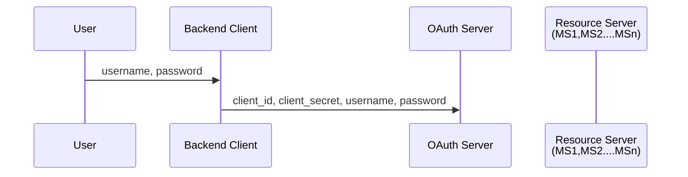

# OAuth Architucture



----

👤User via browser🧑‍💻 send user_name and password to Backend Server.

```ini
username=user1
password=pwd
```

Backend server as **API Gateway**🥅🚧⛩️ bellow payload to **Authorization Server**

```json
{
    "client_id": "api-gateway1",
    "client_secret": "gateway-secret",
    "username": "user1",
    "password": "user-secret"
}
```

------------


Here you go — the entire explanation formatted cleanly as a **Markdown file**.

You can copy-paste this directly into a `.md` file.

---

# OAuth2 Flow with API Gateway + Spring Authorization Server

### *User Login With Username/Password, Gateway With Client Credentials*

---

## 🔎 Overview

This document explains how authentication works when:

* User logs in using **only username + password**
* API Gateway communicates with **Spring Authorization Server (SAS)**
* SAS issues **JWT access tokens**
* Microservices trust the gateway (not the user directly)

---

## ✅ Correct Authentication Flow

### ### 1️⃣ User → API Gateway

User sends only their credentials:

```
POST /login
username=user1
password=pass123
```

No client_id, no client_secret.

---

## 2️⃣ API Gateway → Spring Authorization Server

Gateway authenticates *both*:

### ✔ The **user**

* username
* password

### ✔ The **application** (gateway itself)

* `client_id=api-gateway`
* `client_secret=gateway-secret`

These are **static** and pre-registered in SAS.

**Request sent to SAS:**

```
POST /oauth2/token
grant_type=password
client_id=api-gateway
client_secret=gateway-secret
username=user1
password=pass123
```

---

## 3️⃣ Spring Authorization Server → API Gateway

SAS validates:

* The client (gateway)
* The user credentials
* Grant type permissions

Then SAS generates:

* Access Token (JWT)
* Refresh Token (optional, stored in Redis)

Response example:

```json
{
  "access_token": "eyJhbGciOi...",
  "refresh_token": "def50200...",
  "token_type": "Bearer",
  "expires_in": 3600
}
```

---

## 4️⃣ API Gateway → User

Gateway returns the token to the user:

```json
{
  "access_token": "eyJhbGciOi...",
  "refresh_token": "def50200..."
}
```

Only this token is used for all next requests.

---

## 5️⃣ User → API Gateway (Subsequent API Calls)

User sends only the JWT token:

```
GET /orders
Authorization: Bearer eyJhbGciOi...
```

* No username
* No password
* No client_id
* No client_secret

Gateway validates the token and forwards request to microservices.

---

# 🧠 Key Principles

### ✔ 1. **client_id and client_secret belong to the application, not the user**

The API Gateway is a “client” in OAuth terminology.
Users never send client_id or secret.

### ✔ 2. **Users authenticate only with username/password**

Simple login.

### ✔ 3. **Token generation needs both:**

* User credentials (username/password)
* Client credentials (client_id/client_secret)

### ✔ 4. **API Gateway validates all tokens**

Microservices trust the gateway and don’t perform authentication.

---

# 🧾 Final Flow Summary

| Step        | User              | API Gateway                    | SAS                     |
| ----------- | ----------------- | ------------------------------ | ----------------------- |
| Login       | username/password | adds client_id & client_secret | validates user + client |
| Token Issue | —                 | receives tokens                | generates tokens        |
| API Request | sends token       | validates JWT                  | microservice processes  |

---

If you want, I can also generate:

* A **sequence diagram** (markdown or PNG)
* **Spring Authorization Server configuration**
* **Redis token store setup**
* **API Gateway filters for JWT validation**
* Entire **production-ready folder structure**

Just tell me!


