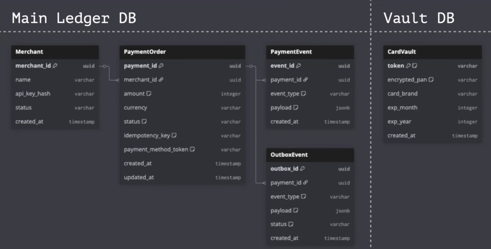
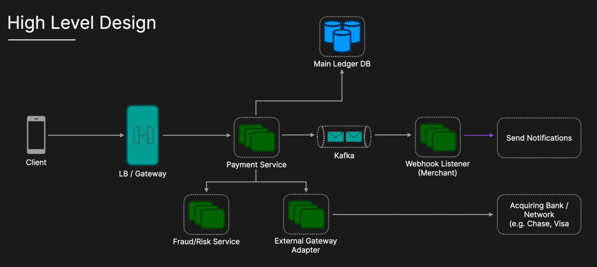
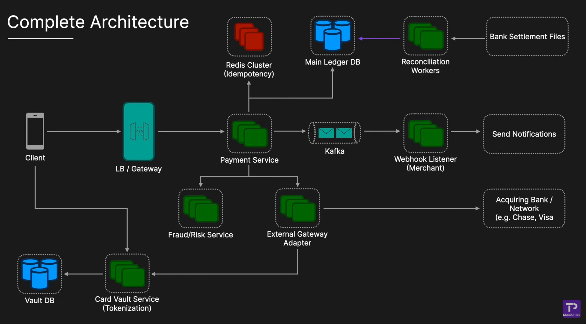

# System Design

### What system Design needed?

1. Requirements (**Functional and Non-Functional** Requirements)
2. Data Model
3. API Design
4. HLD and LLD

# [Stripe Payment Gateway](https://youtu.be/djc2vfpCvso)

## Functional Requirements

* Process payments
* Process Refunds
* Webhooks / Notifications
* View Payment status

## Non-Functional Requirements

* **Strict Consistency & Accuracy** - No Money loss or double charges.
* **High Availability & Reliability** - Targeting 99.99% uptime, No payment downtime.
* **Security & Compliance** - PCI DSS standards
* **Idempotency** - Network failure will happen, therefore retry must not result duplicate charges.
* **Performance** - Relatively Low Latency for the initial synchronous authentication step. Try to ensure 2 to 3 seconds
  for user checkout experience.

## Data Model

For payment gateway, a Relation Database(PostgreSQL, MySQL) are the standard choice because ACID compliance is
non-negotiable.



* **Merchant** - It stores profile and authentication details.
* **PaymentOrder** - It a financial ledger of individual checkout attempt.
* **PaymentEvent** - This will be immutable append only audit log, that records every raw interaction and response
  payload from external acquiring banks.
* **OutboxEvent** - This functions as a reliable temporary staging area for the transactional outbox pattern to
  guarantee that asynchronous events like merchant webhooks are safely published to Kafka without data loss.
* **CardVault** - This could be a card vault, and this will be physically isolated database to securely store encrypted
  credit card numbers Eg: PAN (_Primary Account Number_)

## PCI DCS Compliance

* It's a security standard that organizations must comply with when handling Credit card data.
* Initial design implies that raw PAN number flows through the API Gateway and Payment Service.
* So building **highly restricted isolated microservice** to handle raw card data.

## API Design

```jsonpath
1. Create a Payment
POST /v1/payments
Headers :
  Authorization: Bearer <merchant_api_key>
  Idempotency—Key: <uuid_generated_by_client>
Body :
{
  "amount": 5000,
  "currency": "USD",
  "payment_method_token": "tok 12345", // Tokenized card details
  "description": "Order #987"
}

2. Get Payment Status
GET /v1/payments/{payment_id}

3. Issue a Refund
POST /v1/payments/{payment_id}/refunds
Headers :
Idempotency—Key: <uuid>
Body :
{
    "amount": 5000, // Partial refunds are possible
}
```

## High Level Design



## Completed Architecture


